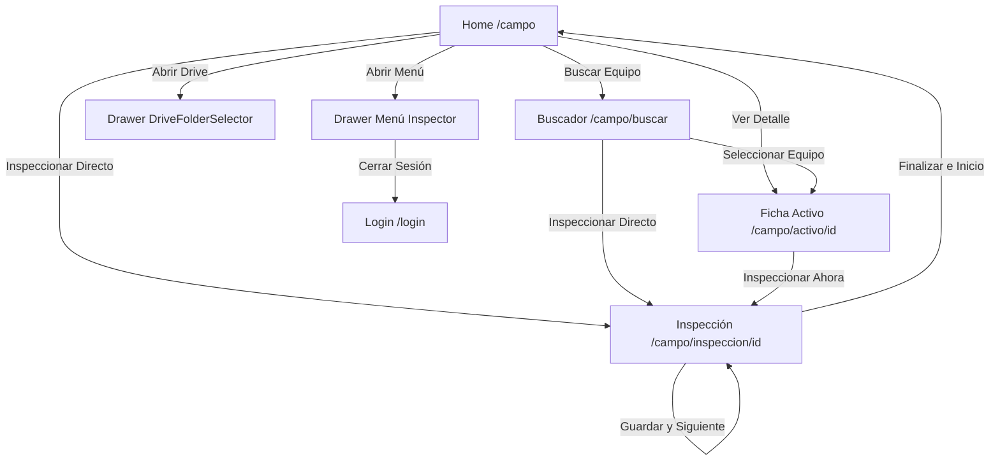

# AUDITORÍA DE ARQUITECTURA REAL — MODO CAMPO (AGENTE-INSPECTOR)

Fecha de auditoría: 9 de Agosto, 2026
Estado: ETAPA 1 — AUDITORÍA TÉCNICA (SIN MODIFICACIONES DE CÓDIGO)

---

## 1. Estructura Real del Proyecto

El proyecto **Agente-Inspector** se compone de un backend en Python con FastAPI y un frontend web PWA en Next.js (App Router).

```
Agente-Inspector/
├── app/                        # Backend FastAPI (Python)
│   ├── core/                   # Seguridad, auditoría, configuración, dependencias
│   ├── db/                     # Conexiones e inicialización SQLite / PostgreSQL
│   ├── models/                 # Modelos Pydantic y schemas
│   ├── routers/                # Endpoints API REST (19 routers)
│   ├── services/               # Lógica de negocio (Drive, IA, Inspecciones, Reportes)
│   └── utils/                  # Utilidades backend
│
├── frontend/                   # Frontend Next.js 16 (React 19, Tailwind CSS v4)
│   ├── app/                    # Next.js App Router (Rutas de producción y Modo Campo)
│   │   ├── campo/              # Módulo MODO CAMPO (PWA / Mobile-First)
│   │   │   ├── activo/[id]/    # Ficha compacta de activo (page.js)
│   │   │   ├── buscar/         # Buscador de equipos (page.js)
│   │   │   ├── inspeccion/[id]/# Captura de inspección (page.js)
│   │   │   ├── campo.css       # Estilos específicos de campo
│   │   │   ├── layout.js       # Layout del área de campo
│   │   │   └── page.js         # Home Modo Campo
│   │   ├── globals.css         # Estilos globales y tokens CSS
│   │   ├── layout.js           # Root Layout
│   │   ├── login/              # Página de login
│   │   └── sw.js               # Service Worker PWA
│   ├── components/             # Componentes React de la UI
│   │   ├── campo/              # Componentes especializados de Modo Campo
│   │   └── ...                 # Componentes generales del Dashboard Desktop
│   ├── hooks/                  # Custom Hooks (red, sincronización, precarga)
│   ├── services/               # Integración de API HTTP (api.js)
│   ├── utils/                  # Base de datos local (Dexie IndexedDB), Haptics, Sync
│   └── src/                    # (Carpeta remanente de boilerplate, inactiva)
│
├── docs/                       # Documentación técnica
│   └── MOBILE_UI_AUDIT.md      # Este documento de auditoría
│
├── MANUAL.md                   # Manual de usuario/operación
└── README.md                   # Documentación principal del proyecto
```

---

## 2. Estructura Real del Frontend

El frontend corre en **Next.js 16.2.7** con **React 19.2.4** utilizando la estructura de App Router en `frontend/app/`.

### Estructura del Módulo Modo Campo (`frontend/app/campo/`):
- `frontend/app/campo/page.js`: Página Principal (Home) de Modo Campo (~474 líneas).
- `frontend/app/campo/layout.js`: Contenedor base de la sección campo.
- `frontend/app/campo/campo.css`: Estilos visuales custom para tarjetas e inputs.
- `frontend/app/campo/buscar/page.js`: Pantalla de búsqueda de equipos en tiempo real (~160 líneas).
- `frontend/app/campo/activo/[id]/page.js`: Ficha técnica y diagnósticos previos del activo (~234 líneas).
- `frontend/app/campo/inspeccion/[id]/page.js`: Formulario de inspección, evidencia multimedia y guardado local (~537 líneas).

### Componentes de Campo (`frontend/components/campo/`):
- `BadgeEstadoSync.jsx`: Barra superior de estado de conectividad (Online/Offline), contador de borradores, cola de pendientes y reintentos.
- `BotonEstado.jsx`: Selector de estado de salud del equipo (Bueno, Regular, Crítico, Fuera de Ruta) con clases de acento y colores.
- `CampoBottomNav.jsx`: Barra de navegación inferior flotante fija (`fixed bottom-0`).
- `CapturaFoto.jsx`: Módulo de toma de fotografía con cámara (`capture="environment"`), compresión en cliente y categorización (Succión, Impulsión, General).
- `GrabadoraAudio.jsx`: Módulo de grabación de notas de voz con `MediaRecorder` API, reproducción local y eliminación.
- `HistorialActivoModal.jsx`: Modal superpuesto con el historial combinado (IndexedDB + API remota + diagnósticos Gemini).
- `BannerInstalacionPWA.jsx`: Notificación de instalación PWA.

### Componentes de Navegación y Drive Integrados:
- `frontend/components/DriveFolderSelector.jsx`: Selector/Navegador de carpetas de Google Drive de la Planta.

---

## 3. Estructura Real del Backend

El backend está construido sobre **FastAPI** (`app/main.py`), interactuando con SQLite (`agente_inspector.db`) y servicios externos (Google Drive API, Google Gemini AI).

### Routers Consumidos por Modo Campo:
1. **`app/routers/auth.py`** (`/api/auth`):
   - `POST /api/auth/login`: Autenticación de inspectores con JWT token.
   - `GET /api/auth/me`: Verificación de sesión activa.
2. **`app/routers/equipos.py`** (`/api/equipos`):
   - `GET /api/equipos/`: Obtiene la lista completa de equipos de la planta.
   - `GET /api/equipos/{id}`: Obtiene el detalle de un equipo específico por ID.
3. **`app/routers/itinerarios.py`** (`/api/itinerarios`):
   - `GET /api/itinerarios/`: Obtiene la lista de equipos asignados al inspector para el día actual.
   - `GET /api/itinerarios/progreso`: Progreso de avance diario de inspecciones.
4. **`app/routers/inspecciones.py`** (`/api/inspecciones`):
   - `POST /api/inspecciones/batch`: Endpoint principal de sincronización masiva offline/online. Recibe lote de inspecciones con fotos (Base64) y audios.
   - `GET /api/inspecciones/{equipo_id}`: Consulta el historial de inspecciones del equipo.
5. **`app/routers/dashboard_pg.py`** (`/api/dashboard`):
   - `GET /api/dashboard/history`: Endpoint secundario para obtener el historial oficial de planta y diagnósticos Gemini.
6. **`app/routers/drive.py`** (`/api/drive`):
   - `GET /api/drive/root`: ID de la carpeta raíz de Google Drive.
   - `GET /api/drive/carpetas`: Subcarpetas de la planta.
   - `POST /api/drive/crear_carpeta`: Creación de nuevas carpetas en Drive.

---

## 4. Mapa de Home (`/campo`)

- **Ruta de acceso**: `frontend/app/campo/page.js`
- **Componentes renderizados**:
  - `BadgeEstadoSync` (Superior sticky)
  - Tarjeta de Estado de Red (Online / Offline) y Notificaciones
  - Saludo al Inspector y Tarjeta de Usuario (`usuarioActual`)
  - Accesos Rápidos (Grilla 2x2: Equipos, Historial, Drive / Planta, Pendientes)
  - Buscador rápido de equipos con autocompletado instantáneo sobre IndexedDB (`equipos_cache`)
  - Resumen de Actividades (Pendientes en cola local vs Completados hoy)
  - Tarjeta de Itinerario de Hoy ("Mi Itinerario de Hoy", orden de inspección)
  - `CampoBottomNav` (Barra inferior flotante)
  - Drawer de Navegador Drive (`showDriveDrawer` -> `DriveFolderSelector`)
  - Drawer de Menú Inspector (`showMenuDrawer`)
  - Modal de Confirmación de Logout (`showLogoutModal`)
- **Hooks utilizados**: `useOnlineStatus`, `usePreCargaInicial`, `useLiveQuery` (Dexie), `useRouter`.
- **Services utilizados**: `apiService.getCurrentUser()`, `apiService.getToken()`.
- **Utils utilizados**: `db.js` (`equipos_cache`, `itinerario_cache`), `limpiarBaseDatosLocal()`, `vibrar()`.

---

## 5. Mapa de Inspección (`/campo/inspeccion/[id]`)

- **Ruta de acceso**: `frontend/app/campo/inspeccion/[id]/page.js`
- **Componentes renderizados**:
  - `BadgeEstadoSync`
  - Encabezado con botón Volver, Nombre del Equipo (`codigoActivo` • `nombreActivo`), y Menú de opciones
  - Control segmentado de pestañas: `INSPECCIÓN` | `HISTORIAL` | `ARCHIVOS`
  - Pestaña Inspección:
    - `SelectorEstadoHealth` (`BotonEstado.jsx`: Bueno, Regular, Crítico, Fuera de Ruta)
    - `CapturaFoto` (Toma de fotos con cámara trasera, compresión en cliente, asignación de categoría)
    - `GrabadoraAudio` (Grabación de notas de voz)
    - Observaciones con Textarea y botón de Dictado por Voz (`SpeechRecognition` Web API)
    - Botón Principal "Guardar y Siguiente"
  - Pestaña Archivos: Resumen de conteo de fotos y audios adjuntos
  - `CampoBottomNav`
  - Modal de Confirmación de Guardado (`mostrarModalConfirmacion` con opción de ir al Siguiente Equipo del Itinerario)
  - `HistorialActivoModal` (activado desde pestaña HISTORIAL o botón del header)
- **Hooks utilizados**: `useParams`, `useSearchParams`, `useRouter`, `useOnlineStatus`.
- **Services utilizados**: `apiService.getCurrentUser()`.
- **Utils utilizados**: `db.js` (`inspecciones_pendientes`, `archivos_pendientes`, `equipos_cache`, `itinerario_cache`), `vibrar()`, `vibrarExito()`, `vibrarError()`.

---

## 6. Mapa de Drive

- **Ubicación del componente**: `frontend/components/DriveFolderSelector.jsx`
- **Integración en Modo Campo**: Se invoca modalmente en la Home (`/campo`) desde el botón "Drive / Planta" o el Menú lateral Inspector.
- **Funcionalidades**:
  - Consulta de la carpeta raíz (`GET /api/drive/root`).
  - Navegación jerárquica por subcarpetas (`GET /api/drive/carpetas?parent_id=...`).
  - Navegación ascendente / descendente con pila de historial (`navStack`).
  - Creación de carpetas en tiempo real (`POST /api/drive/crear_carpeta`).
  - Persistencia de la carpeta seleccionada en `localStorage` (`campo_drive_folder_id`, `campo_drive_folder_title`).
  - Vinculación implícita de la carpeta de Drive a las inspecciones locales pendientes para la posterior subida del lote.

---

## 7. Mapa de Navegación

### Componente de Navegación Principal:
- `CampoBottomNav.jsx` (`frontend/components/campo/CampoBottomNav.jsx`):
  - **Inicio**: Redirige a `/campo`.
  - **Equipos**: Redirige a `/campo/buscar`.
  - **Botón Central (+)**: Acción rápida para enfocar el buscador de equipos.
  - **Historial**: Redirige a `/campo` (abre el historial del equipo activo).
  - **Menú**: Dispara el callback `onOpenMenu` para abrir el Menú Drawer lateral.

### Flujo de Pantallas y Rutas:


---

## 8. Dependencias

Las librerías del `package.json` involucradas en el funcionamiento de Modo Campo son:

| Dependencia | Versión | Uso en Modo Campo |
| :--- | :--- | :--- |
| **`dexie`** | `^4.4.4` | Wrapper de IndexedDB para almacenamiento offline de equipos, itinerarios e inspecciones. |
| **`dexie-react-hooks`** | `^4.4.0` | Hook `useLiveQuery` para reactividad en tiempo real con datos de IndexedDB. |
| **`browser-image-compression`** | `^2.0.2` | Compresión de imágenes en el navegador antes de guardar en IndexedDB (límite 0.5MB, max 1024px). |
| **`lucide-react`** | `^1.29.0` | Iconografía vectorial (Search, Camera, Mic, Wifi, CheckCircle2, etc.). |
| **`next`** | `16.2.7` | Framework web React (App Router, Server/Client components). |
| **`react` / `react-dom`** | `19.2.4` | UI Library (Hooks, Suspense, State, Effects). |
| **`@serwist/next` / `@serwist/sw`**| `^9.5.12` | Gestión de Service Worker PWA para funcionamiento offline. |
| **`tailwindcss`** | `^4.3.3` | Framework de CSS utilitario. |

---

## 9. Hooks Utilizados

### Custom Hooks Propios:
1. **`useOnlineStatus`** (`frontend/hooks/useOnlineStatus.js`):
   - Escucha los eventos globales `online` y `offline` de `window`.
   - Consulta reactivamente con `useLiveQuery` los conteos de inspecciones en IndexedDB: `pendingCount`, `errorCount`, `draftCount`, `completedTodayCount`.
   - Expone las funciones `forceSync()` y `retryErrors()`.
2. **`usePreCargaInicial`** (`frontend/hooks/usePreCargaInicial.js`):
   - Ejecuta al iniciar la app una descarga de respaldo en segundo plano de todos los equipos (`apiService.getEquipos()`) y del itinerario del día (`apiService.getItinerarioHoy()`).
   - Almacena/actualiza la caché local en `equipos_cache` e `itinerario_cache` de IndexedDB.

### Hooks Estándar de React y Next.js:
- `useState`, `useEffect`, `useRef`, `useCallback`, `Suspense`.
- `useRouter`, `usePathname`, `useParams`, `useSearchParams` (Next.js Navigation).

---

## 10. Services Utilizados

- **`apiService`** (`frontend/services/api.js`):
  - Encapsula todas las llamadas HTTP `fetch` al backend REST.
  - Manejo de cabeceras de autorización JWT (`Bearer token`).
  - Métodos clave consumidos por Campo:
    - `login(username, password)`
    - `getCurrentUser()`, `getToken()`
    - `getEquipos(q)`
    - `getEquipoById(id)`
    - `getItinerarioHoy()`
    - `getHistorial(equipoId)`
    - `subirInspeccionesBatch(loteInspecciones)`

---

## 11. Utils Utilizados

1. **`db.js`** (`frontend/utils/db.js`):
   - Configuración del esquema de IndexedDB mediante Dexie (versión 2):
     - `inspecciones_pendientes`: Cola local de inspecciones con `estado_sync` (`borrador`, `pendiente`, `subiendo`, `error`).
     - `archivos_pendientes`: Blobs binarios de fotos y audios asociados a `inspeccion_id`.
     - `equipos_cache`: Copia local de la lista de equipos.
     - `itinerario_cache`: Lista de equipos asignados al itinerario del día.
     - `historial_cache`: Registros históricos de inspecciones.
   - Exporta `limpiarBaseDatosLocal()`.
2. **`haptics.js`** (`frontend/utils/haptics.js`):
   - Control de respuesta háptica por vibración táctil (`navigator.vibrate`): `vibrar(ms)`, `vibrarExito()`, `vibrarError()`.
3. **`sync.js`** (`frontend/utils/sync.js`):
   - Algoritmo principal de sincronización en segundo plano (`sincronizarColaPendientes()`).
   - Convierte los Blobs de IndexedDB a cadenas Base64 (`blobToBase64`).
   - Envía los datos mediante `apiService.subirInspeccionesBatch()`.
   - Limpia los registros de IndexedDB tras confirmación exitosa del backend.
   - Sincronización automática periódica (polling cada 30 segundos si hay red).

---

## 12. Componentes Reutilizables Existentes

- **`BadgeEstadoSync.jsx`**: Indicador global de estado offline/online y cola de sincronización.
- **`BotonEstado.jsx`** (`SelectorEstadoHealth`): Tarjetas seleccionables de estado de salud del activo.
- **`CampoBottomNav.jsx`**: Barra de navegación inferior móvil.
- **`CapturaFoto.jsx`**: Botón de cámara, compresión en cliente, filtro de categoría y galería de fotos.
- **`GrabadoraAudio.jsx`**: Grabador de micrófono con reproductor audio WebM incorporado.
- **`HistorialActivoModal.jsx`**: Modal de historial unificado local + servidor + IA.
- **`DriveFolderSelector.jsx`**: Navegador modal de estructuras de Google Drive.

---

## 13. Componentes Demasiado Grandes (Monolitos a Descomponer)

Durante la inspección del código real se detectó que varias páginas concentran demasiadas responsabilidades en un solo archivo:

1. **`frontend/app/campo/inspeccion/[id]/page.js`** (~537 líneas):
   - Concentra la gestión de estado de borrador, inicialización de IndexedDB, integración de Web Speech API (dictado por voz), guardado de archivos, navegación a siguiente equipo y lógica de modales.
2. **`frontend/app/campo/page.js`** (~474 líneas):
   - Agrupa tarjetas de usuario, accesos rápidos, autocompletado con filtro directo en Dexie, tarjetas de itinerario, drawer de Menú, drawer de Drive y modal de confirmación de logout.
3. **`frontend/components/DriveFolderSelector.jsx`** (~359 líneas):
   - Mezcla la llamada directa a `fetch` HTTP sin pasar por `apiService`, la gestión de rutas, la creación de carpetas y el diseño de lista.
4. **`frontend/components/campo/HistorialActivoModal.jsx`** (~267 líneas):
   - Contiene la lógica de combinación y deduplicación de 4 fuentes distintas de datos (IndexedDB local, caché de equipos, caché de historial y endpoints HTTP remotos).

---

## 14. Posibles Problemas Identificados

1. **Inconsistencia de Estilos (Inline vs Utility Classes)**:
   - Se observan estilos inline hardcodeados (ej. `style={{ color: '#ffffff', backgroundColor: '#020617' }}`) mezclados con Tailwind CSS en `HistorialActivoModal.jsx` y `activo/[id]/page.js`. Esto dificulta el mantenimiento del tema oscuro móvil.
2. **Directorio Inactivo / Redundante**:
   - Existe una carpeta `frontend/src/app/` con archivos predeterminados de Next.js (`page.js`, `globals.css`) que no se utiliza y genera confusión estructural respecto a `frontend/app/`.
3. **Fallbacks Hardcodeados en Producción**:
   - En `inspeccion/[id]/page.js` y `page.js` existen fallbacks explícitos para el ID `107` ("VENTILADOR 431-506") en caso de no hallar datos en IndexedDB.
4. **Llamadas Directas a Fetch HTTP**:
   - En `DriveFolderSelector.jsx` se hacen llamadas directas mediante `fetch('http://localhost:8000/api/drive/...')` con la URL base hardcodeada en lugar de utilizar la abstracción centralizada de `apiService` (`API_BASE_URL`).

---

## 15. Riesgos Durante el Rediseño Visual

> [!WARNING]
> **Riesgos Críticos de Romper Funcionalidad Operativa:**
> 1. **Pérdida de Reactividad Offline (Dexie / IndexedDB)**:
>    La aplicación funciona en áreas industriales sin señal. Si se refactorizan las páginas sin preservar los hooks de Dexie (`useLiveQuery`), el inspector perderá el almacenamiento automático de borradores.
> 2. **Desconexión con la Cola de Sincronización Batch**:
>    La estructura de datos que guardan `CapturaFoto` y `GrabadoraAudio` en `archivos_pendientes` debe coincidir exactamente con los parámetros esperados por `sync.js` y el endpoint `/api/inspecciones/batch` del backend.
> 3. **Riesgo de Regresión en Dictado por Voz (Web Speech API)**:
>    La función `SpeechRecognition` es sensible al estado del componente; modularizar este botón requiere mantener el estado de transcripción sin perder el texto ingresado por el usuario.

---

## 16. Recomendación de Arquitectura Futura (Etapas Posteriores)

Para transformar la interfaz de **Modo Campo** en una experiencia 100% Mobile-First fluida, ordenada y mantenible sin alterar la lógica de negocio ni el backend:

1. **Descomposición Modular de Componentes (Clean Component Architecture)**:
   - Extraer subcomponentes atómicos en `frontend/components/campo/`:
     - `HeaderInspector.jsx` (Información de usuario y notificaciones).
     - `AccesosRapidosGrid.jsx` (Acceso a Equipos, Historial, Drive, Pendientes).
     - `ResumenActividadesCard.jsx` (Conteo de pendientes/completados).
     - `TarjetasItinerario.jsx` (Lista/Tarjeta de equipos asignados en la jornada).
     - `DictadoVozInput.jsx` (Textarea con botón de micrófono integrado).
2. **Refactorización de la Capa de Servicios de Drive**:
   - Mover los llamados HTTP de `DriveFolderSelector.jsx` hacia `apiService` (`frontend/services/api.js`) usando `API_BASE_URL` dinámico.
3. **Consolidación del Sistema de Diseño Visual (Dark Mobile First)**:
   - Eliminar todos los objetos de estilos inline (`style={{ ... }}`).
   - Definir clases utilitarias uniformes en `campo.css` o `globals.css` utilizando la paleta nativa de Tailwind (`bg-slate-950`, `bg-[#090d16]`, `border-slate-800`, `text-sky-400`).
4. **Limpieza de Archivos Obsoletos**:
   - Eliminar la carpeta inactiva `frontend/src/` para evitar ambigüedades.
